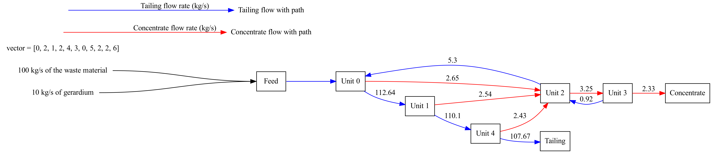

# Gormanium rush
"The Gerardium Rush" repository is dedicated to the implementation of a Genetic Algorithm (GA) optimized for the task of maximizing the recovery of a valuable mineral named "gerardium" through the process of separation. The GA simulates the operation of separation units such as flotation cells or spirals, which are arranged in circuits to extract valuable material while also separating waste. The challenge lies in designing these circuits for optimal recovery and purity of gerardium, balancing the trade-off between these two factors based on economic considerations. The repository confines its scope to two product streams - a valuable concentrate stream and a waste-dominated tailings stream. The success of the separation circuit is evaluated based on the purity and weight of the gerardium in the concentrate stream. Given the vast number of potential circuit configurations, the genetic algorithm is leveraged to find an optimal solution, proving its effectiveness in tackling discrete optimization problems.

## Installation

To compile
```
mkdir build
cd build
cmake --toolchain ../toolchain.cmake ..
make
cd ..
```
Currently the toolchain file requires `g++-13` and `gcc-13` installed, but any c++/c compiler that supports openmp will work. Replace `g++-13` and `gcc-13` to the path to the respective supporting compiler in toochain.cmake. To remake, clean up the build directory and rerun the compile commands.

To run, from the base directory run
```
./build/bin/Circuit_Optimizer
```
## File generation
To write the result to file, from the base directory run
```
mkdir out
./build/bin/Circuit_Optimizer
```
## Macros
The package defines several macros for user to use.
### PARALLEL_ENABLE
Macro for MPI functionalities. If defined, the program will utilize MPI if `parallel_mpi` is set to 1. `MPI_Init()` should be called inside `main` before any `GA` object is created. `MPI_Finalize()` is handled in `GA`'s destructor, meaning that only one `GA` object should be created and destroyed.
### OUT_RESULT_TO_FILE
Macro for write result to file.
### PERFORMANCE_ANALYSIS_MACRO
Macro for doing extra work to perform some analysis.
## Test

To run the test
```
./build/tests/bin/test_GA
./build/tests/bin/test_simulator
./build/tests/bin/test_validity
```
## Post-processing



The python script to generate a visual representation of the simulation results. The script reads data from the .dat file from the default ./out directory or a user-specified directory, processes the data, and generates a directed graph as shown above. The script will read all .dat files in the target directory and save them as one or more SVG images in the output/ directory. You can use the script by running the following command in Terminal:
```
python src/graph.py your_directory_path
```
Replace your_directory_path with the path to the directory containing your .dat files. 
**Each .dat file must have two line vectors**, the first line is the vector of the units, of size 2n+1. the second line is the in/out flow for each individual unit, size should be 2n.

Please note that the script requires the graphviz Python package. If it's not already installed, you can install it with: 
```
pip install graphviz
```
Also, the script uses the **os** and **sys** modules from Python's standard library. These should be available in any standard Python environment.


## Documentation

To generate configuration file
```
doxygen -g
```

To generate documentation
```
doxygen Doxyfile
```

## License
Distributed under the MIT License. See `LICENSE.md` for more information.
